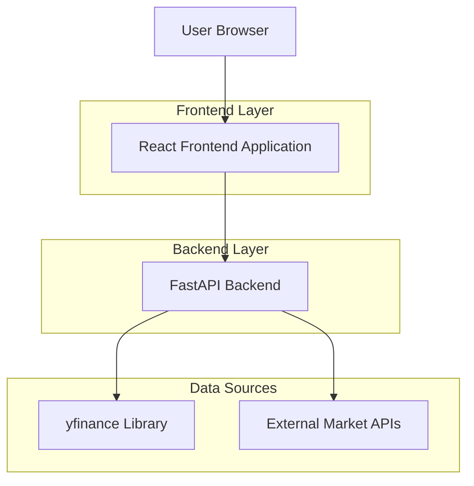

# Technical Architecture Design

## 1. System Architecture
The application follows a standard client-server architecture:
- **Frontend**: Single Page Application (SPA) built with React, served via Vite.
- **Backend**: RESTful API built with FastAPI (Python).
- **Data Layer**: `yfinance` library wrapping Yahoo Finance API.
- **Database**: PostgreSQL (for User and Watchlist data).

## 2. Technology Stack
- **Frontend**:
    - React 18
    - TypeScript
    - Tailwind CSS 3
    - Vite
    - State Management: Zustand (implied by guidelines)
    - Routing: React Router
    - Icons: Lucide React
- **Backend**:
    - Language: Python 3.x
    - Framework: FastAPI
    - Data Fetching: `yfinance`
    - Database ORM: SQLAlchemy / Pydantic
    - Server: Uvicorn
- **Database**:
    - PostgreSQL (Supabase recommended per guidelines)

## 3. API Design
### 3.1 Stock Data
- `GET /api/stock/quote/{symbol}`: Get current stock details.
- `GET /api/stock/history/{symbol}?period={period}`: Get historical data.
- `GET /api/stock/search?q={query}`: Search for stocks.

### 3.2 Market Data
- `GET /api/market/overview`: Get general market info.
- `GET /api/market/sectors`: Get sector performance.
- `GET /api/market/industries?sector={sector}`: Get industry info.

### 3.3 System
- `GET /api/health`: Health check.

## 4. Data Model
### 4.1 Users
- `id` (UUID, PK)
- `email` (String, Unique)
- `name` (String)
- `created_at`, `updated_at`

### 4.2 Watchlist
- `id` (UUID, PK)
- `user_id` (UUID, FK)
- `symbol` (String)
- `added_at`

## 5. Server Structure
The backend will be organized into controllers and services:
- **Routers**: Handle HTTP requests and validation.
- **Controllers/Services**: Business logic and interaction with `yfinance`.
- **Models**: Pydantic models for API responses and SQLAlchemy models for DB.
